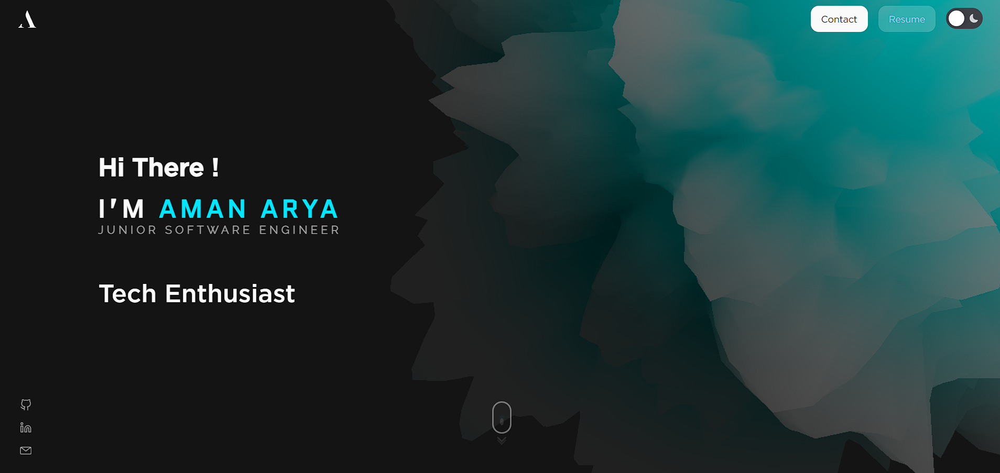

# Portfolio Website - Aman Arya

Welcome to my portfolio website built with Nextjs:14, Typescript, Tailwind, Framer-Motion, Three.js, and hosted on Vercel with a custom domain [amanarya.com](https://www.amanarya.com)



## Overview

This project showcases my portfolio and allows visitors to view my work and send me messages directly through the website.

## Live Demo

You can see the live demo of this project at [https://www.amanarya.com](https://www.amanarya.com)

## Installation

To run this project locally, follow these steps:

1. Clone the repository:

   ```bash
   git clone https://github.com/Am4nn/Portfolio-Next-Website.git
   ```

2. Navigate to the project directory:

    ```bash
    cd Portfolio-Next-Website
    ```

3. Install the dependencies:

    ```bash
    npm install
    ```

4. Start the React app:

    ```bash
    npm run dev
    ```

5. Open your web browser and visit <http://localhost:3000/> to view the project locally.

## Features

- Next.js 14: Enhances the portfolio with server-side rendering and static site generation, ensuring optimal performance and user experience.

- TypeScript: Improves code quality and maintainability by adding static typing to JavaScript, catching errors early in the development process.

- Framer Motion: Adds smooth and visually appealing animations to the portfolio, enhancing the user interface and overall presentation.

- Tailwind CSS: Simplifies styling and ensures a consistent design across the portfolio with its utility-first approach to CSS.

- Three.js: Three.js is used for 3D graphics rendering, adding a visually appealing aspect to the portfolio

- Serverless API: The website uses a serverless function hosted on Vercel to handle form submissions and send emails using Nodemailer

- Custom Domain: The portfolio is hosted on a custom domain [www.amanarya.com](https://www.amanarya.com)

## Contact

If you have any questions, feedback, or would like to get in touch with me, you can use the contact form on my portfolio or email me at <125aryaaman@gmail.com>

## License

This project is licensed under the MIT License - see the LICENSE file for details.
