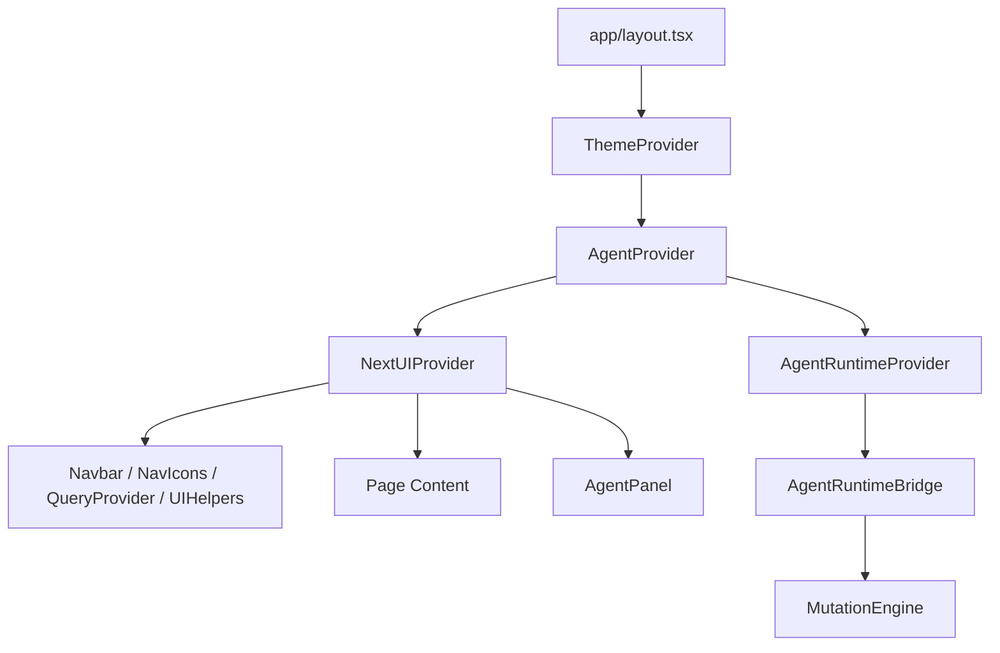
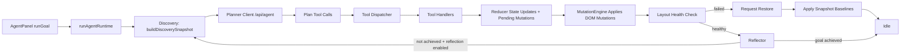
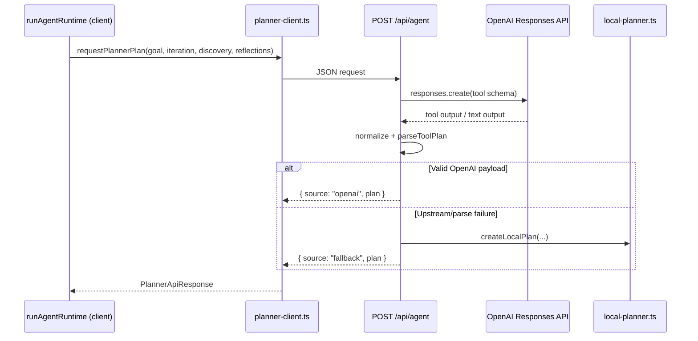
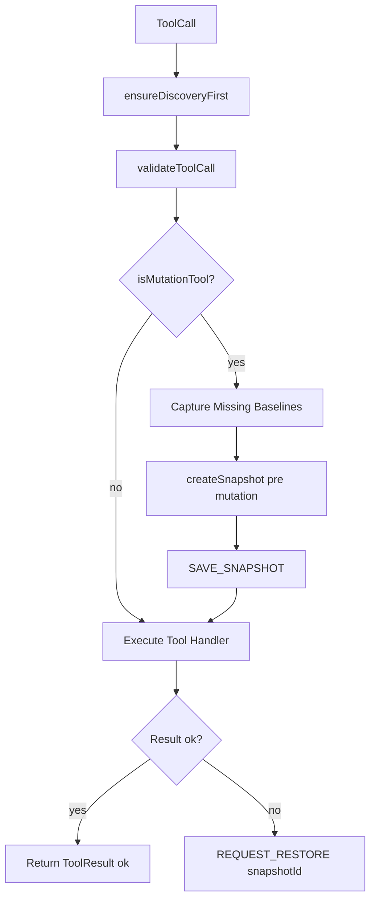
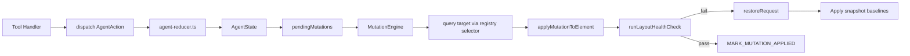
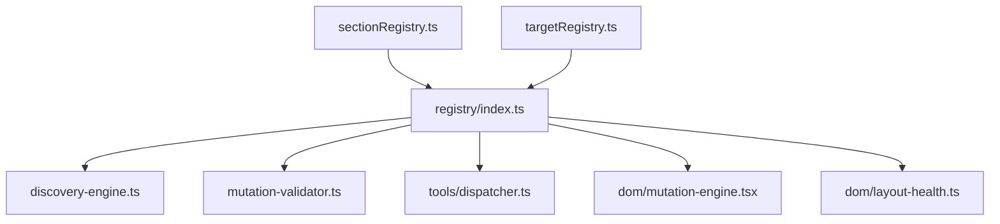
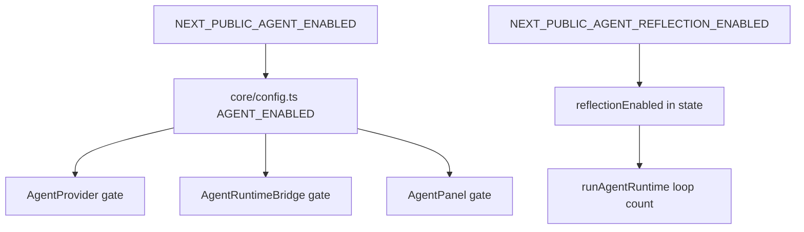
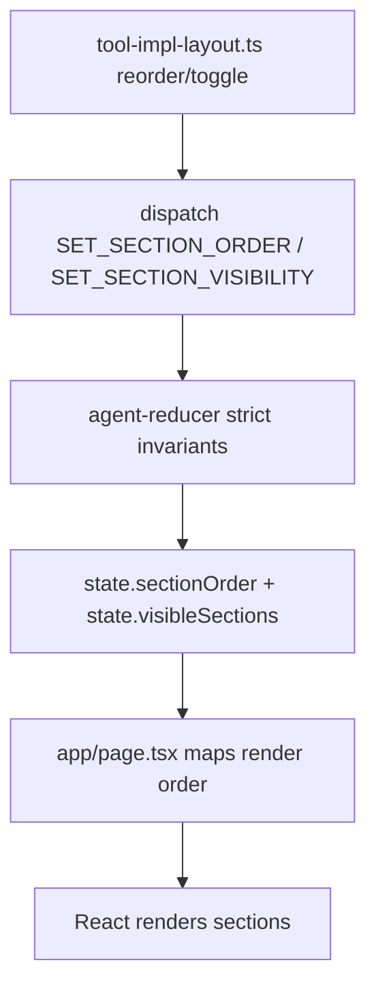

# Agent Runtime Architecture (Connected View)

This document shows how the Agent Runtime modules connect end to end in the React app.

## 1) App-Level Integration

## 2) Runtime Execution Loop

## 3) Server Planner Path (Hybrid)

## 4) Tool Dispatch + Transaction Safety

## 5) State and DOM Mutation Interaction

## 6) Registry-Driven Discovery and Targeting

## 7) Agent Feature Flags

## 8) React Rendering Control (Section Order + Visibility)

## 9) Module Map

- UI + integration: `app/layout.tsx`, `app/page.tsx`, `lib/agent/components/AgentPanel.tsx`
- Provider + state: `lib/agent/components/AgentProvider.tsx`, `lib/agent/state/agent-context.tsx`, `lib/agent/state/agent-reducer.ts`
- Runtime: `lib/agent/runtime/agent-runtime.ts`, `lib/agent/runtime/reflector.ts`
- Planning: `lib/agent/runtime/planner-client.ts`, `app/api/agent/route.ts`, `lib/agent/runtime/local-planner.ts`, `lib/agent/runtime/planner-schema.ts`
- Discovery + registry: `lib/agent/discovery/discovery-engine.ts`, `lib/agent/registry/*`
- Validation + tools: `lib/agent/validation/mutation-validator.ts`, `lib/agent/tools/*`
- DOM + snapshots: `lib/agent/dom/mutation-engine.tsx`, `lib/agent/dom/layout-health.ts`, `lib/agent/snapshots/snapshot-manager.ts`
- Config: `lib/agent/core/config.ts`, `lib/agent/core/constants.ts`
